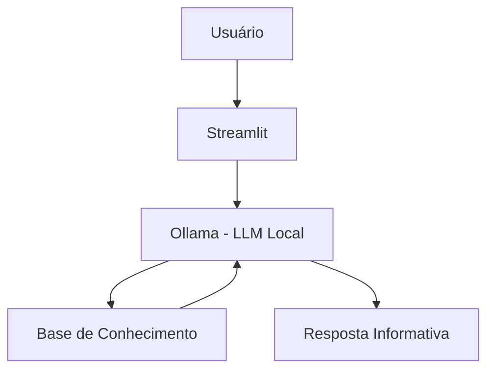

# 🥗 InfoNutri - Assistente de Nutrição Informativa

> Agente de IA Generativa que explica conceitos de nutrição de forma simples e personalizada, usando os próprios dados de consumo da pessoa usuária como exemplos práticos.

## 💡 O Que é o InfoNutri?

O InfoNutri é um assistente de nutrição que **informa**, não prescreve. Ele explica conceitos como nutrientes, rótulos de alimentos e mitos populares sobre alimentação, usando uma abordagem didática e exemplos concretos baseados no perfil da pessoa usuária.

**O que o InfoNutri faz:**

- ✅ Explica conceitos de nutrição de forma simples
- ✅ Usa dados da pessoa usuária como exemplos práticos
- ✅ Ajuda a interpretar rótulos e termos de alimentos
- ✅ Desmistifica crenças populares sobre alimentação

**O que o InfoNutri NÃO faz:**

- ❌ Não prescreve dietas, cardápios ou metas de calorias/macronutrientes
- ❌ Não diagnostica condições de saúde (intolerâncias, deficiências, doenças)
- ❌ Não substitui um nutricionista ou profissional de saúde certificado

## 🏗️ Arquitetura



**Stack:**

- Interface: Streamlit
- LLM: Ollama (modelo local `gpt-oss`)
- Dados: JSON/CSV mockados

## 📁 Estrutura do Projeto

```
├── data/                          # Base de conhecimento
│   ├── perfil_usuario.json        # Perfil da pessoa usuária
│   ├── registro_consumo.csv       # Registro de consumo alimentar
│   ├── historico_duvidas.csv      # Dúvidas anteriores
│   ├── alimentos_nutrientes.json  # Catálogo de alimentos
│   ├── glossario_nutrientes.json  # Glossário de nutrientes e termos
│   └── faq_mitos_verdades.json    # Mitos e verdades sobre alimentação
│
├── docs/                          # Documentação completa
│   ├── 01-documentacao-agente.md  # Caso de uso e persona
│   ├── 02-base-conhecimento.md    # Estratégia de dados
│   ├── 03-prompts.md              # System prompt e exemplos
│   ├── 04-metricas.md             # Avaliação de qualidade
│   └── 05-pitch.md                # Apresentação do projeto
│
└── src/
    └── app.py                     # Aplicação Streamlit
```

## 🚀 Como Executar

### 1. Instalar Ollama

```bash
# Baixar em: ollama.com
ollama pull gpt-oss
ollama serve
```

### 2. Instalar Dependências

```bash
pip install streamlit pandas requests
```

### 3. Rodar o InfoNutri

```bash
streamlit run src/app.py
```

## 🎯 Exemplo de Uso

**Pergunta:** "O que significa 'light' no rótulo?"
**InfoNutri:** "'Light' significa que o produto tem redução de pelo menos 25% em algum componente (calorias, açúcar ou gordura) comparado à versão original. Não significa necessariamente que é mais saudável no geral — vale sempre conferir a tabela nutricional completa. Quer que eu explique a diferença entre 'light' e 'diet'?"

**Pergunta:** "Monte uma dieta pra eu emagrecer"
**InfoNutri:** "Eu não posso montar uma dieta pra você, porque isso depende de uma avaliação individual que só um nutricionista pode fazer com segurança. Posso te explicar como funcionam os grupos alimentares ou tirar dúvidas sobre nutrientes específicos, se quiser!"

## 📊 Métricas de Avaliação

| Métrica | Objetivo |
|---------|----------|
| **Assertividade** | O agente responde o que foi perguntado? |
| **Segurança** | Evita prescrever dietas ou diagnosticar (anti-alucinação)? |
| **Coerência** | A resposta é adequada ao perfil e às restrições da pessoa usuária? |

## 🎬 Diferenciais

- **Personalização:** Usa os dados de consumo e restrições da própria pessoa usuária nos exemplos
- **100% Local:** Roda com Ollama, sem enviar dados para APIs externas
- **Educativo:** Foco em informar, não em prescrever ou diagnosticar
- **Seguro:** Estratégias de anti-alucinação e limites de escopo documentados

## 📝 Documentação Completa

Toda a documentação técnica, estratégias de prompt e casos de teste estão disponíveis na pasta [`docs/`](./docs).
